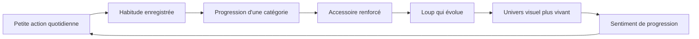
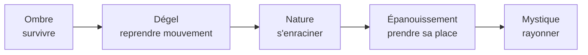
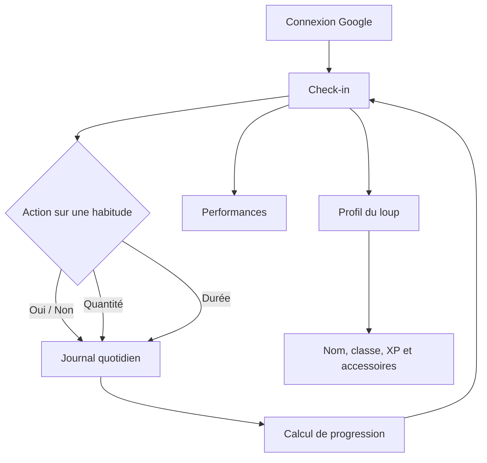
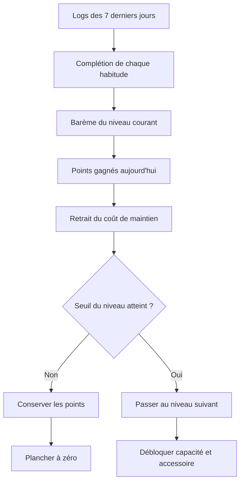
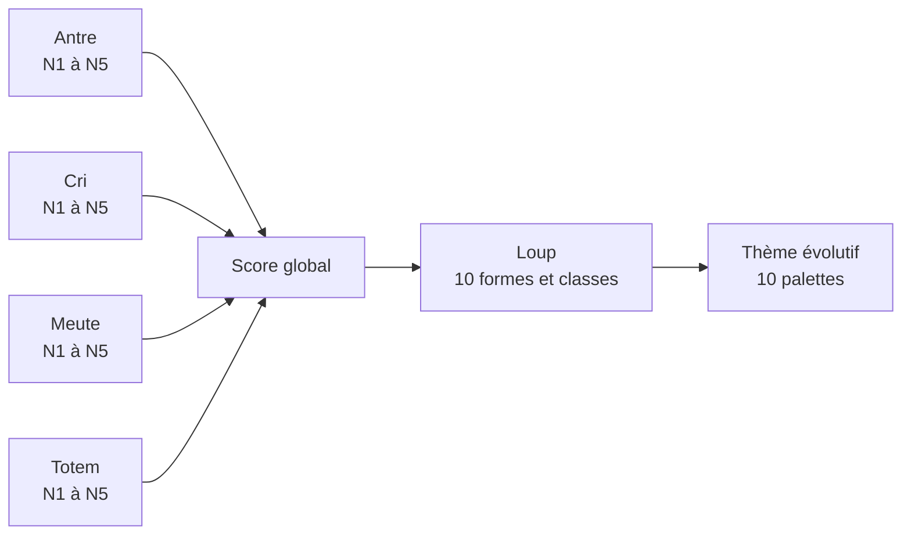
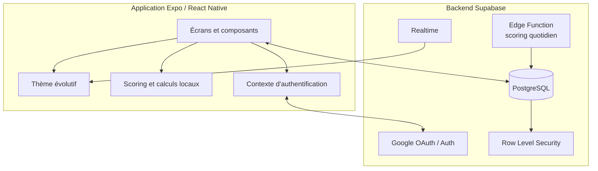
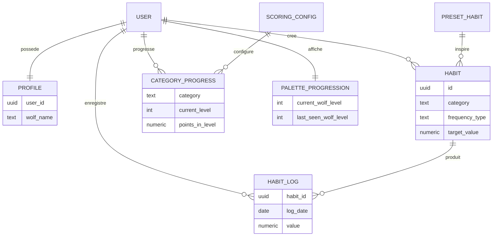

# LifeXP — Vision, expérience et architecture

> LifeXP transforme la construction d'habitudes en une aventure personnelle. L'utilisateur ne remplit pas seulement une liste : il prend soin d'un loup, développe son territoire et voit son univers évoluer avec sa régularité.

## 1. Résumé

LifeXP est une application de suivi d'habitudes gamifiée, construite autour de quatre dimensions de vie :

| Dimension | Symbole | Devise | Sens |
|---|---|---|---|
| Soin de soi | Antre | Paille | Créer un espace intérieur stable et protecteur |
| Développement personnel | Cri | Souffle | Apprendre, s'exprimer et grandir |
| Vie familiale | Meute | Interaction | Entretenir les liens et la présence aux autres |
| Vie professionnelle | Totem | Influence | Construire, contribuer et laisser une trace |

Chaque habitude accomplie nourrit l'une de ces dimensions. Leur progression combinée fait évoluer le loup, ses accessoires et l'apparence générale de l'application.

## 2. Philosophie de l'application

### Progresser plutôt que performer

LifeXP cherche à rendre visible une transformation qui est normalement lente et abstraite. Une action isolée semble petite ; sa répétition construit pourtant une identité. Le loup représente cette identité en devenir.

L'application privilégie donc :

- la régularité plutôt que l'exploit ponctuel ;
- des progrès concrets plutôt qu'un simple pourcentage ;
- une évolution durable — un niveau acquis ne redescend pas ;
- plusieurs dimensions de vie plutôt qu'un score unique déconnecté du quotidien ;
- une récompense émotionnelle et symbolique, pas seulement numérique.

### Le loup comme miroir, pas comme juge

Le loup ne sanctionne pas l'utilisateur. Il reflète le soin apporté à sa vie. Au début, l'univers est fermé, froid et peu coloré. À mesure que les habitudes s'installent, il dégèle, devient organique, puis mystique.

Cette métaphore raconte un passage :

L'interface elle-même devient une récompense. La progression ne se contente pas d'ajouter un badge : elle transforme l'ambiance, les couleurs, la profondeur et les formes de l'application.

### Une difficulté progressive

Les premiers niveaux limitent volontairement le nombre d'habitudes. Le but est d'éviter une motivation initiale trop ambitieuse qui mène à l'abandon. De nouveaux emplacements sont débloqués quand la pratique devient plus solide.

Plus le niveau monte, plus les attentes de complétion et le coût quotidien de maintien augmentent. La progression demande donc une stabilité croissante, tout en protégeant les niveaux déjà acquis.

## 3. Expérience utilisateur

L'application s'organise autour de trois espaces principaux :

| Écran | Fonction |
|---|---|
| Check-in | Voir les habitudes de la semaine et enregistrer les actions du jour |
| Performances | Observer les tendances sur la semaine, le mois ou l'année |
| Profil | Voir le loup, sa classe, son expérience et les quatre accessoires |

### Habitudes et préréglages

Une habitude appartient à une catégorie et peut être :

- binaire : faite ou non faite ;
- quantitative : nombre de répétitions ;
- temporelle : durée réalisée ;
- planifiée selon une fréquence et un objectif minimum.

Des habitudes prédéfinies accélèrent la création, tandis que la création manuelle permet d'adapter le nom, l'emoji, la catégorie, la fréquence et l'objectif.

### Retour quotidien

Le check-in doit rester rapide. L'utilisateur agit directement sur les cartes d'habitudes, consulte sa série récente et voit immédiatement ce qui a été accompli. La priorité est de réduire la distance entre « je l'ai fait » et « je l'enregistre ».

## 4. Système de progression

### Progression des catégories

Chaque catégorie possède cinq niveaux. Un calcul quotidien examine les sept derniers jours, attribue des points selon le taux de complétion, puis applique un coût de maintien lié au niveau courant.

Principes importants :

- le total de points ne descend jamais sous zéro ;
- une maintenance ne peut être appliquée qu'une fois par jour ;
- les points peuvent varier, mais un niveau acquis est conservé ;
- chaque niveau autorise un nombre maximal d'habitudes ;
- les règles sont configurées en base de données.

### Progression globale du loup

Le niveau du loup n'est pas une moyenne opaque. Il est dérivé de l'équilibre entre les quatre catégories. Certains paliers demandent qu'une partie, puis l'ensemble des dimensions, atteignent un niveau donné.

Cette règle évite qu'une seule sphère de vie compense entièrement toutes les autres.

Les classes vont du **Louveteau des Cendres** au **Loup Dieu des Origines**. Chaque classe possède ses propres mantras et une forme d'avatar associée.

### Accessoires symboliques

Chaque catégorie fait évoluer un élément du monde du loup :

- l'Antre passe de la *Tanière des Cendres* à la *Caverne des Cristaux* ;
- le Cri passe du *Souffle Muet* au *Chant des Origines* ;
- la Meute passe du *Loup Solitaire* à la *Légion des Ombres* ;
- le Totem passe de la *Pierre Brute* au *Totem Divin*.

Ces noms donnent une dimension narrative à des progrès autrement purement statistiques.

## 5. Identité visuelle évolutive

LifeXP ne possède plus de mode clair/sombre séparé. Le thème est entièrement déterminé par le niveau du loup.

| Niveaux | Phase | Ambiance |
|---|---|---|
| 1 | Ombre fermée | Noir, désaturation, formes resserrées |
| 2 à 4 | Dégel | Bruns et neutres chauds, ouverture progressive |
| 5 à 6 | Organique | Terre, sauge, nature et profondeur |
| 7 à 8 | Épanouissement | Couleurs vivantes, énergie et espace |
| 9 à 10 | Mystique | Violet profond, lumière, vert luminescent |

Les couleurs sont normalisées automatiquement pour respecter au minimum :

- un ratio de contraste de **4,5:1** pour les textes ;
- un ratio de **3:1** pour les icônes, bordures et contrôles importants ;
- un choix automatique entre texte noir et blanc sur les couleurs dynamiques.

La lisibilité reste ainsi constante, même lorsque l'identité visuelle change fortement.

## 6. Architecture fonctionnelle

### Technologies principales

- **Expo et React Native** pour Android, iOS et le web ;
- **Expo Router** pour la navigation par fichiers ;
- **TypeScript** pour les modèles, règles et composants ;
- **Supabase Auth** pour la connexion Google ;
- **PostgreSQL/Supabase** pour les habitudes, logs, profils et progressions ;
- **Row Level Security** pour isoler les données de chaque utilisateur ;
- **Edge Functions** pour appliquer le scoring quotidien ;
- **Supabase Realtime** pour synchroniser le niveau visuel du loup.

### Données principales

## 7. Sécurité et fiabilité

Les données personnelles sont protégées par des règles RLS : un utilisateur ne peut accéder qu'à ses propres habitudes, journaux, progression et profil. Les opérations sensibles de maintenance peuvent être exécutées avec un rôle serveur dédié.

Le système prévoit également :

- un stockage sécurisé de la session ;
- une validation des niveaux et catégories en base ;
- une prévention du double scoring quotidien ;
- des valeurs de configuration de secours si la configuration distante est indisponible ;
- des tests unitaires sur le scoring, les niveaux, l'authentification et les contrastes.

## 8. Ce que LifeXP cherche à faire ressentir

LifeXP veut remplacer la culpabilité du suivi d'habitude par un sentiment d'attachement et de continuité. L'utilisateur ne revient pas uniquement pour cocher une case : il revient voir ce que ses gestes répétés sont en train de construire.

La promesse peut se résumer ainsi :

> **Prends soin de tes habitudes, et le monde autour de ton loup prendra vie.**

Le produit associe ainsi trois formes de progression :

1. **pratique** — les actions sont réellement accomplies ;
2. **mesurable** — les catégories, points et niveaux rendent le chemin visible ;
3. **symbolique** — le loup et son univers donnent du sens à cette évolution.

LifeXP n'est donc pas seulement un habit tracker avec des points. C'est une représentation vivante de la personne que l'utilisateur construit, un jour après l'autre.
